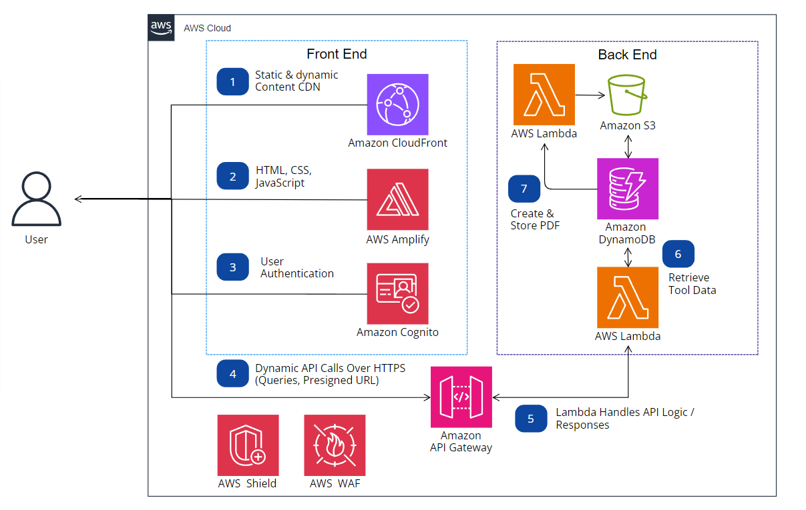

# Architecture Diagram 

## Steps

IN PROGRESS

## Services Used

* **[Amazon CloudFront](https://aws.amazon.com/cloudfront/)**
* **[AWS Amplify](https://aws.amazon.com/amplify/)**
* **[Amazon Cognito](https://aws.amazon.com/cognito/)**
* **[Amazon API Gateway](https://aws.amazon.com/api-gateway/)**
* **[AWS Lambda](https://aws.amazon.com/lambda/)**
* **[Amazon DynamoDB](https://aws.amazon.com/dynamodb/)**
* **[AWS S3](https://aws.amazon.com/s3/)**
* **[AWS Shield](https://aws.amazon.com/shield/)**
* **[AWS WAF](https://aws.amazon.com/waf/)**
## Deployment
IN PROGRESS

## FAQ
IN PROGRESS